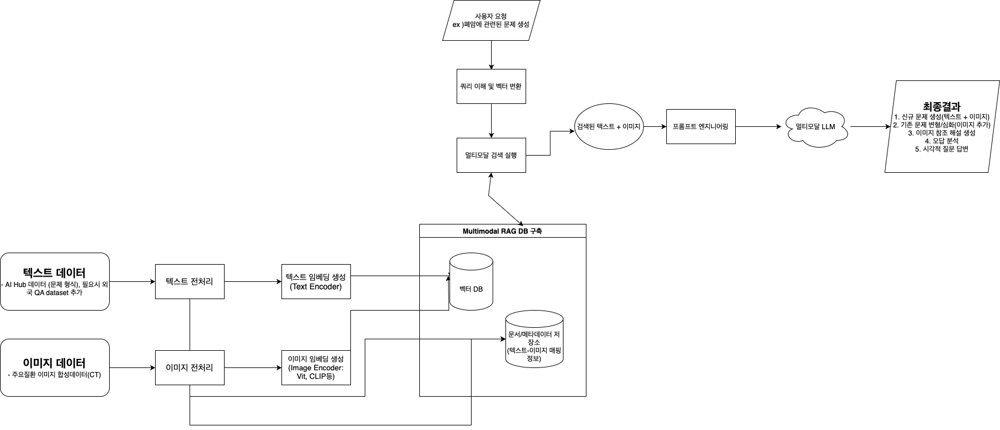
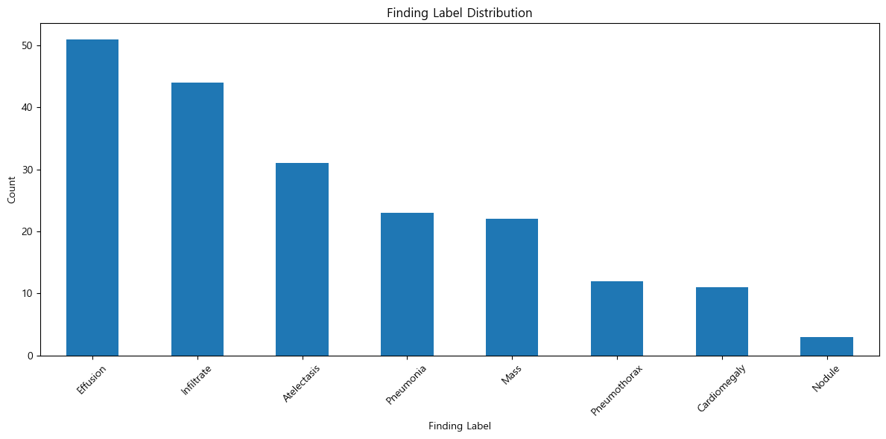

# Vision
vision LLM
## 프로젝트 소개
이 프로젝트는 Vision LLM을 활용한 이미지 분석 및 처리 시스템입니다.

## 주요 기능
- 이미지 객체 감지 및 분류
- 이미지 캡셔닝
- 시각적 질의응답 (VQA)
- 이미지 생성 및 편집

## 기술 스택
- Python
- PyTorch
- Transformers
- OpenCV
- NumPy

## 0.data analysis

## 1 phase
image vector similarity

## 2 phase
image + text vector

## 3 phase
text quering & image indexing

## 4 phase
image RAG

## ppt

[데모 ppt](https://docs.google.com/presentation/d/1Ohb55wHANbF2CMJg_gOqgeK_2AlPFTXsbJbBUeZ8scs/edit?usp=sharing)
